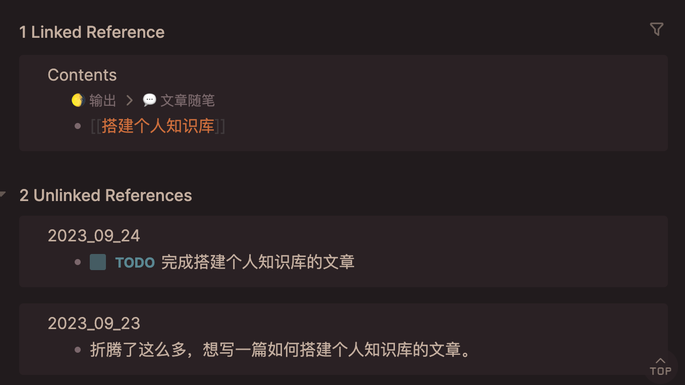
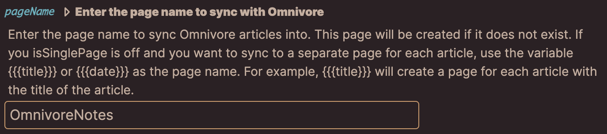
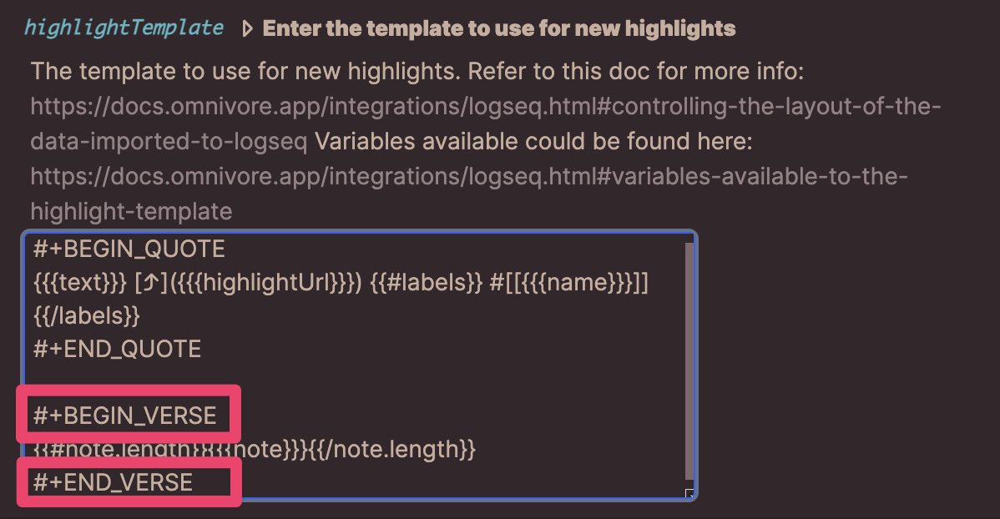

public:: true

- 微信公众号文章链接：[Logseq+Omnivore 搭建个人知识库](https://mp.weixin.qq.com/s/ZvGOD6Ug2C6ReNmnXqz7Yg)
-
- ## 使用的软件
  ==Logseq、Omnivore==、Raycast，Raycast是作为锦上添花的存在，非必需。
-
- ## 这样结合使用有什么用
  ==首先，什么是双向链接？==
	- 在每篇笔记的末尾都会有这两块内容：
		- Linked Reference
		- Unlinked References
	- 比方说这篇笔记的标题是“搭建个人知识库”，Linked Reference就会自动显示有哪些笔记中出现了这个页面，Unlinked References中则会显示有哪些页面中出现了同样的文字，Logseq通过双向链接找到它们并关联在一起。
	- 
- ==所以Logseq+Omnivore的使用流程是：==
	- 1. 用户使用Omnivore搜集信息，并通过高亮和批注初步处理信息；
	- 2. 插件按照设定好的频率，自动将内容导入至Logseq；
	- 3. 未来某天，在进行某主题的输出创作时，Logseq的双链功能会自动联想到有关记录。
-
- ## 软件简介
  ==Logseq==
	- 是markdown编辑器、日记本、任务清单、任何类型的记录。
	- 支持双链、扩展插件
	- 所有东西都可以直接写在日记里，`[[…]]`中输入标题就会直接新建page。page可以是页面，也可以是标签。更好看一点的标签格式是`#标签名称+空格`。
- ==Omnivore==
	- 全平台同步，有应用和浏览器插件。
	- 核心是稍后阅读，阅读时可以高亮文本和写批注，可以一键复制高亮和批注笔记。
	- 当然不是所有网页都需要被收录的，有时候只是想在浏览网页时随手高亮做个提醒，这种简单、碎片化的情境可以使用`五彩`。
		- 五彩是个订阅制的插件，免费版本每个月可以划200条，能直接在原网页上划线、批注，并且能生成定位点快速跳转。
- ==Raycast==
	- 订阅制，但免费功能已经很够用了。
	- 形态是类似聚焦搜索的启动器软件，是瑞士军刀般的存在。
-
- ## 关联它们所需的插件
- ==Logseq中：Omnivore==
	- [将所有阅读数据同步到Logseq](https://docs.omnivore.app/zh/integrations/logseq.html)
	- 添加插件后会自动跳转至Omnivore创建API的页面，create API后点击复制按钮，粘贴到Logseq中。可以在设置里调节更新频率、导入范围、格式。
	- 频率默认是60分钟，点击编辑器顶部的Omnivore图标会立即更新。
	- 导入模式默认为`just highlights`，仅导入高亮和对高亮的批注。
	- 如果预估自己有可能创建名为`Omnivore`的页面，建议在设定里修改默认的`pageName`，免得冲突。
		- 
	- **注意，在Omnivore中批注时默认只能输入一段文字，导入换行的批注会导致显示错误。**这部分可以根据自己的需求改动粉色框中的部分，如以下几个可以多段批注的方式**（不同主题可能产生不同效果）**：
		- 使用`#+BEGIN_VERSE`和`#+END_VERSE`，能正常使用markdown。
		- 使用`<code>`和`</code>`，将批注放入代码块，会变色、斜体、字号小，markdown无效。
		- 使用`#+BEGIN_EXAMPLE`和`#+END_EXAMPLE`，不变色、不斜体、字号小，markdown无效。
		- 
- Raycast中：Logseq
	- 呼出Raycast后输入store，搜索Logseq，按回车键下载。
	- 主要是使用quick note功能，只要在Raycast中输入全称或简写qn，回车后就会进入记录界面。如果自己设置了快捷键，可以省去2步，更加快速。
	- 第一次使用时需要设置logseq图谱的路径位置。
- ---
- 基于**输入-处理-输出**模式，还有其他组合，如Obsidian+简悦、+Zotero等，都比较出色。
-